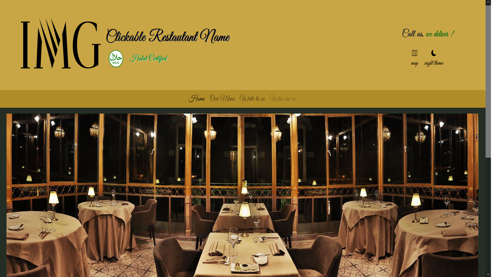
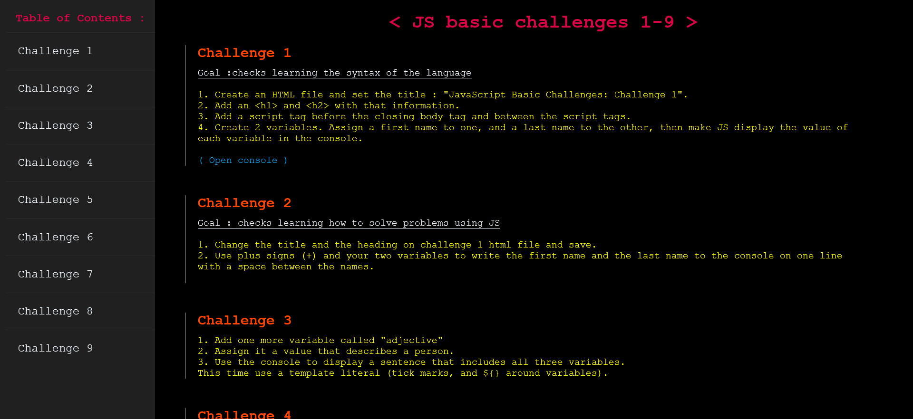

# Portfolio Projects
Personal projects made to prepare a portfolio. 

<b><u>1- "Dummy Restaurant Page" (
  <a href="https://github.com/Watch-Me-Fly/Projects-Practicing-Portfolio/tree/main/Responsive-Restau">GitHub code</a>  /   <a href="https://htmlpreview.github.io/?https://github.com/Watch-Me-Fly/Projects-Practicing-Portfolio/blob/main/Responsive-Restau/Index.html">HTML preview</a>)
  </u></b> 
 
HTML, CSS, & Bootstrap were used to create this page.  

<i>Screenshot</i> 
 

<b><u>2- "Parallax Page" (
  <a href="https://github.com/Watch-Me-Fly/Projects-Practicing-Portfolio/blob/main/Parallax">GitHub code</a>  /   <a href="https://htmlpreview.github.io/?https://github.com/Watch-Me-Fly/Projects-Practicing-Portfolio/blob/main/Parallax/Index.html">HTML preview</a>)
  </u></b> 
 
HTML, & CSS were used to create this page.  

<i>Screenshot</i> 
 

<b><u>3- "Documentation page" (
  <a href="https://github.com/Watch-Me-Fly/Portfolio/tree/main/manualLike-sideMenu">GitHub code</a>  /   <a href="https://htmlpreview.github.io/?https://github.com/Watch-Me-Fly/Portfolio/blob/main/manualLike-sideMenu/JS-basic-challenges.html">HTML preview</a>)
  </u></b> 
 
HTML, CSS, & JavaScript were used to create this page.  

<i>Screenshot</i> 
 

<b><u>4- "Tourism page" (
  <a href="https://github.com/Watch-Me-Fly/Portfolio/tree/main/manualLike-sideMenu">GitHub code</a>  /   <a href="https://htmlpreview.github.io/?https://github.com/Watch-Me-Fly/Portfolio/blob/main/manualLike-sideMenu/JS-basic-challenges.html">HTML preview</a>)
  </u></b> 
 
HTML, CSS, & JavaScript were used to create this page.  

<i>Screenshot</i> 
 
